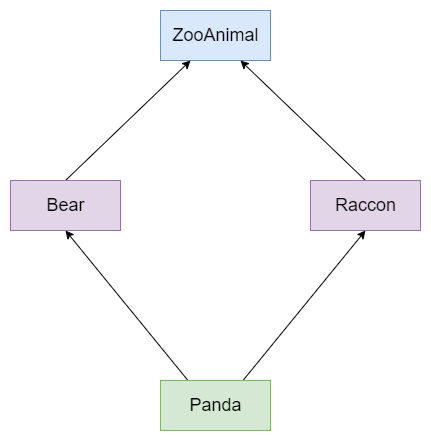

<div align="center">
<a href="https://github.com/Kinvy66/interview">📖 Github</a>
&emsp;&emsp; | &emsp;&emsp;
📚 Docsify
</div> 
<br>

<b><details><summary>💡 关于</summary></b>

📚 本仓库是个人整理的C/C++ 技术方向的面试笔记，灵感来源于 [https://github.com/huihut/interview](https://github.com/huihut/interview) (主要原因还是自己太菜，秋招目前0offer),通过这种方式把面试中的八股整理一下。内容和文档结构部分参考上面提到的仓库。

🔖 说明：<span style= "background: yellow">容易遗漏的点用黄色背景色标注</span> ; <font color=red>重要的用红色字体标注</font>; 

?> 需要注意的点在引用块中

</details>


## 📑 目录

- [➕ C/C++](#cc)
- [⭐️ Effective](#effective)
- [📦 STL](#stl)
- [〽️ 数据结构](#data-structure)
- [⚡️ 算法](#algorithm)
- [❓ Problems](#problems)
- [💻 操作系统](#os)
- [☁️ 计算机网络](#computer-network)
- [🌩 网络编程](#network-programming)
- [💾 数据库](#database)
- [📏 设计模式](#design-pattern)
- [⚙️ 链接装载库](#link-loading-library)
- [📚 书籍](#books)
- [💯 复习刷题网站](#review-of-brush-questions-website)
- [📜 License](#license)


<a id="cc"></a>

## ➕ C/C++

### const

#### 1. 作用
`const` 是一个类型修饰的关键字，被其修饰的类型具有不可变的特性。

- 1. 修饰普通变量，说明该变量不可以被改变；
- 2. 修饰指针，分为指向常量的指针(pointer to const)和自身是常量的指针(常量指针，const pointer);
- 3. 修饰引用，指向常量的引用(reference to const), 用于形参类型，级避免拷贝，同时避免函数对值的修改；
- 4. 修饰成员函数，说明该成员函数内不能改变成员变量。


#### 2. const与指针和引用
名称区分：顶层const, 即变量本身是const,其值不能改变； 底层const，即变量指向的变量的是const，自身的值可以改变，但是它指向的是一个const的变量；

- 指针
  - 指向常量的指针

    ```cpp
    const int ci = 42;
    int i = 18;
    const int *p1 = &ci; // 这里的const是底层const
    const int *p2 = &i;  // 可以用非const变量地址初始化指向常量的指针， 但是后续不能使用该指针解引用改变该变量的值
    *p2 = 10;     // 错误
    ```

  - 常量指针，指针的值不能改变
    ```cpp
    int i = 42;
    int j;
    int *const p = &i;  // 顶层const
    p = &j;   // 错误, p是常量指针，初始化后之后不能再改变指向
    *p = 10;  // 正确， 解引用改变的是它指向的变量的值
    ```
  注意：`const`的位置只与 `*` 有关，在`*`之前是指向常量的指针，在`*`之后是常量指针

    ```cpp
    const int * const p;
    int const * const p; // 等价声明
    ```

- 引用
  
  引用本身自带顶层const属性，即引用一旦初始化就不能改变指向，所以对引用加const 就是加底层const, 使引用指向一个具有const的变量
  ```cpp
  const int ci = 42;
  int i = 10;
  int& ri = i;
  const int& cri = ci;
  const int& crj = i;   // 正确
  int& rj = ci;         // 错误
  ```

#### 3. 使用
const在成员函数和函数传参中的使用

```cpp
// const成员函数
class Entity {
public:
    int size() const { 
        // m_number = 42; // 错误， 不能const成员函数中修改任何成员变量的值
        return m_size; 
    }

    int size() { // 和具有const修饰的成员函数构成重载的关系
        return m_size; 
    }

private:
    int m_size;
    int m_number;
};

// const 参数，传递只读参数
void print(const std::string& str) {
    std::cout << str << std::endl;
}

int main() {
    Entity e;
    const Entity c_e;
    auto a = e.size();  // 调用非const成员函数
    auto b =c_e.size(); // 调用const成员函数

    std::string str = "Hello";
    print(str);
    return 0;
}
```

#### 4. const与宏定义#define
| 宏定义 #define|const 常量|
|---|---|
|宏定义，相当于字符替换|常量声明|
|预处理器处理|编译器处理|
|无类型安全检查|有类型安全检查|
|不分配内存|要分配内存|
|存储在代码段|存储在数据段|
|可通过 `#undef` 取消|不可取消|


### static

#### 1. 作用
1. **修饰普通变量**，修改变量的存储区域和生命周期，使变量存储在静态区，在 main 函数运行前就分配了空间，如果有初始值就用初始值初始化它，如果没有初始值系统用默认值初始化它。
2. **修饰普通函数**，表明函数的作用范围，仅在定义该函数的文件内才能使用。在多人开发项目时，为了防止与他人命名空间里的函数重名，可以将函数定位为 static。
3. **修饰成员变量**，修饰成员变量使所有的对象只保存一个该变量，而且不需要生成对象就可以访问该成员。
4. **修饰成员函数**，修饰成员函数使得不需要生成对象就可以访问该函数，但是在 static 函数内不能访问非静态成员。


### this 指针

1. `this` 指针是一个隐含于每一个非静态成员函数中的特殊指针。它指向调用该成员函数的那个对象。
2. 当对一个对象调用成员函数时，编译程序先将对象的地址赋给 `this` 指针，然后调用成员函数，每次成员函数存取数据成员时，都隐式使用 `this` 指针。
3. 当一个成员函数被调用时，自动向它传递一个隐含的参数，该参数是一个指向这个成员函数所在的对象的指针。
4. `this` 指针被隐含地声明为: `ClassName *const this`，这意味着不能给 `this` 指针赋值；在 `ClassName` 类的 `const` 成员函数中，this 指针的类型为：`const ClassName* const`，这说明不能对 `this` 指针所指向的这种对象是不可修改的（即不能对这种对象的数据成员进行赋值操作）；
5. `this` 并不是一个常规变量，而是个右值，所以不能取得 `this` 的地址（不能 `&this`）。
6. 在以下场景中，经常需要显式引用 `this` 指针：
   1. 为实现对象的链式引用；
   2. 为避免对同一对象进行赋值操作；
   3. 在实现一些数据结构时，如 `list`


### inline 内联函数

#### 1. 特征

- 相当于把内联函数里面的内容写在调用内联函数处；
- 相当于不用执行进入函数的步骤，直接执行函数体；
- 相当于宏，却比宏多了类型检查，真正具有函数特性；
- 编译器一般不内联包含循环、递归、switch 等复杂操作的内联函数；
- 在类声明中定义的函数，除了虚函数的其他函数都会自动隐式地当成内联函数。类内声明，类外定义，如果需要内联，必须使用 inline 关键字修饰。


#### 2. 使用
```cpp
// 普通函数的内联
inline int func(int first, int second, ...);

// 定义
inline int func(int first, int second, ...) {
    //....
}

class Entity {
public:
    // 类内定义的成员函数隐式为inline
    int func1() { 
        // ...
    }
    int func2();
};

// 类外定义的函数需要显示的使用inline
inline int Entity::func2() {

}
```

#### 3. 编译器对 inline 函数的处理步骤

1. 将 inline 函数体复制到 inline 函数调用点处；
2. 为所用 inline 函数中的局部变量分配内存空间；
3. 将 inline 函数的的输入参数和返回值映射到调用方法的局部变量空间中；
4. 如果 inline 函数有多个返回点，将其转变为 inline 函数代码块末尾的分支（使用 GOTO）。


#### 4. 优缺点
**优点:**
1. 内联函数同宏函数一样将在被调用处进行代码展开，省去了参数压栈、栈帧开辟与回收，结果返回等，从而提高程序运行速度。
2. 内联函数相比宏函数来说，在代码展开时，会做安全检查或自动类型转换（同普通函数），而宏定义则不会。
3. 在类中声明同时定义的成员函数，自动转化为内联函数，因此内联函数可以访问类的成员变量，宏定义则不能。
4. 内联函数在运行时可调试，而宏定义不可以。


**缺点:**
1. 代码膨胀。内联是以代码膨胀（复制）为代价，消除函数调用带来的开销。如果执行函数体内代码的时间，相比于函数调用的开销较大，那么效率的收获会很少。另一方面，每一处内联函数的调用都要复制代码，将使程序的总代码量增大，消耗更多的内存空间。
2. inline 函数无法随着函数库升级而升级。inline函数的改变需要重新编译，不像 non-inline 可以直接链接。
3. 是否内联，程序员不可控。内联函数只是对编译器的建议，是否对函数内联，决定权在于编译器。

<a id=inline-5></a>

#### 5. 虚函数（virtual）可以是内联函数（inline）吗？
Are "inline virtual" member functions ever actually "inlined"?

- 虚函数可以是内联函数，内联是可以修饰虚函数的，但是当虚函数表现多态性的时候不能内联。
- 内联是在编译期建议编译器内联，而虚函数的多态性在运行期，编译器无法知道运行期调用哪个代码，因此虚函数表现为多态性时（运行期）不可以内联。
- `inline virtual` 唯一可以内联的时候是：编译器知道所调用的对象是哪个类（如 `Base::who()`），这只有在编译器具有实际对象而不是对象的指针或引用时才会发生。

### volatile
> [C/C++ 中volatile的使用(kinvy blog)](https://www.kinvy.cn/posts/tech/coding/volatile/)

volatile 单词的意思是“易变的”。在C/C++中它作为关键字修饰变量时，是告诉编译器这个变量可能是会变化的，不要进行优化。不要从缓存或寄存器中读取值，而是每次都需要从内存重新读取最新的值。

`volatile`用在如下的几个地方：
- 中断服务程序中修改的供其它程序检测的变量需要加`volatile`；
- 多任务环境下各任务间共享的标志应该加`volatile`；
- 存储器映射的硬件寄存器通常也要加`volatile`说明，因为每次对它的读写都可能由不同意义；


### sizeof
`sizeof` 是一个运算符，不是函数。  
- `sizeof` 对数组，得到整个数组所占空间大小
- `sizeof` 对指针，得到指针本身所占空间的大小，32bit机器4字节，64bit机器8字节

?> 在对字符数组时，区分一下`strlen`, `sizeof`会计算终止字符，而 `strlen` 不会计算终止字符

```cpp
const char* s1[] = { "12345" };
char s2[] = { "12345" };
char s3[10] = { "12345" };
const char* s4 = "12345";

std::cout << "sizeof " << sizeof(s1) << " "
    << sizeof(s2) << " "
    << sizeof(s3) << " " 
    << sizeof(s4) << std::endl;

std::cout << "strlen " << strlen(s1[0]) << " "
    << strlen(s2) << " "
    << strlen(s3) << " " 
    << strlen(s4) << std::endl;
// 输出
//sizeof 4 6 10 4   // 指针大小，字符数组(包含'\0'), 字符数组大小，指针大小
//strlen 5 5 5 5   //  字符串长度，字符串长度，字符串长度，字符串长度
```


### extern 

1. 声明变量或函数是外部定义的
   ```cpp
   // add.cpp
    int add(int a, int b) {
        return a + b;
    }
   // main.cpp
   #include <iostream>
   extern int add(int a, int b);
   int main() {
    std::cout << add(10, 42) << std::endl;
    return 0;
   }
   ```

2. 被 `extern "C"` 修饰的变量和函数是按照C语言方式编译和链接的
   ```cpp
   #ifdef __cplusplus
    extern "C" {
    #endif

    void *memset(void *, int, size_t);

    #ifdef __cplusplus
    }
    #endif
   
   ```


### C++中的struct和class
struct 和 class 在C++中没有本质的区别，它们都是定义一个类，只是默认的访问权限不同，struct 的默认访问权限是 `public`， class的默认访问权限是 `private`. 


### union 联合体
联合（union）是一种节省空间的特殊的类，一个 union 可以有多个数据成员，但是在任意时刻只有一个数据成员可以有值。当某个成员被赋值后其他成员变为未定义状态。联合有如下特点：
- 默认访问控制符为 `public`
- 可以含有构造函数、析构函数
- 不能含有引用类型的成员
- 不能继承自其他类，不能作为基类
- 不能含有虚函数
- 匿名 `union` 在定义所在作用域可直接访问 `union` 成员
- 匿名 `union` 不能包含 `protected` 成员或 `private` 成员
- 全局匿名联合必须是静态（`static`）的

使用：
```cpp
#include<iostream>

union UnionTest {
    UnionTest() : i(10) {};
    int i;
    double d;
};

static union {
    int i;
    double d;
};

int main() {
    UnionTest u;

    union {
        int i;
        double d;
    };

    std::cout << u.i << std::endl;  // 输出 UnionTest 联合的 10

    ::i = 20;
    std::cout << ::i << std::endl;  // 输出全局静态匿名联合的 20

    i = 30;
    std::cout << i << std::endl;    // 输出局部匿名联合的 30

    return 0;
}
```

?> 联合体变量占用的内存空间是最大的那个数据类型的大小

### enum 枚举类型
#### 限定作用域的枚举类型
```cpp
enum class open_modes { input, output, append };
```

#### 不限定作用域的枚举类型
```cpp
enum color { red, yellow, green };
enum { floatPrec = 6, doublePrec = 10 };
```


### friend 友元
- 能访问私有成员
- 破坏封装性
- 友元关系不可传递、继承
- 友元关系的单向性
- 友元声明的形式及数量不受限制

### using
> [C++ using 关键字的几种的用法](https://www.kinvy.cn/posts/tech/coding/c++-using/)

#### using 声明
一条 `using` 声明 语句一次只引入命名空间的一个成员。它使得我们可以清楚知道程序中所引用的到底是哪个名字。如:
```cpp
using namespace_name::name;
```

#### 构造函数的using声明
在 C++11 中，派生类能够重用其直接基类定义的构造函数。
```cpp
class Derived : Base {
public:
    using Base::Base;
    /* ... */
};
```
如上 using 声明，对于基类的每个构造函数，编译器都生成一个与之对应（形参列表完全相同）的派生类构造函数。生成如下类型构造函数：

```cpp
Derived(parms) :: Base(args) { }
```


using 指示
using 指示 使得某个特定命名空间中所有名字都可见，这样我们就无需再为它们添加任何前缀限定符了。如：
```cpp
using namespace_name name;
```
尽量少使用 using 指示 污染命名空间
一般说来，使用 using 命令比使用 using 编译命令更安全，这是由于它只导入了指定的名称。如果该名称与局部名称发生冲突，编译器将发出指示。using编译命令导入所有的名称，包括可能并不需要的名称。如果与局部名称发生冲突，则局部名称将覆盖名称空间版本，而编译器并不会发出警告。另外，名称空间的开放性意味着名称空间的名称可能分散在多个地方，这使得难以准确知道添加了哪些名称。

using 使用

尽量少使用 using 指示
```cpp
using namespace std;
```

应该多使用 using 声明
```cpp
int x;
std::cin >> x ;
std::cout << x << std::endl;
```

或者

```cpp
using std::cin;
using std::cout;
using std::endl;
int x;
cin >> x;
cout << x << endl;
```


### explicit
- explicit 修饰构造函数时，可以防止隐式转换和复制初始化
- explicit 修饰转换函数时，可以防止隐式转换，但[按语境转换](https://zh.cppreference.com/w/cpp/language/implicit_conversion)除外

`explicit` 使用
```cpp
struct A
{
    A(int) { }
    operator bool() const { return true; }
};

struct B
{
    explicit B(int) {}
    explicit operator bool() const { return true; }
};

void doA(A a) {}

void doB(B b) {}

int main()
{
    A a1(1);        // OK：直接初始化
    A a2 = 1;        // OK：复制初始化
    A a3{ 1 };        // OK：直接列表初始化
    A a4 = { 1 };        // OK：复制列表初始化
    A a5 = (A)1;        // OK：允许 static_cast 的显式转换 
    doA(1);            // OK：允许从 int 到 A 的隐式转换
    if (a1);        // OK：使用转换函数 A::operator bool() 的从 A 到 bool 的隐式转换
    bool a6(a1);        // OK：使用转换函数 A::operator bool() 的从 A 到 bool 的隐式转换
    bool a7 = a1;        // OK：使用转换函数 A::operator bool() 的从 A 到 bool 的隐式转换
    bool a8 = static_cast<bool>(a1);  // OK ：static_cast 进行直接初始化

    B b1(1);        // OK：直接初始化
    B b2 = 1;        // 错误：被 explicit 修饰构造函数的对象不可以复制初始化
    B b3{ 1 };        // OK：直接列表初始化
    B b4 = { 1 };        // 错误：被 explicit 修饰构造函数的对象不可以复制列表初始化
    B b5 = (B)1;        // OK：允许 static_cast 的显式转换
    doB(1);            // 错误：被 explicit 修饰构造函数的对象不可以从 int 到 B 的隐式转换
    if (b1);        // OK：被 explicit 修饰转换函数 B::operator bool() 的对象可以从 B 到 bool 的按语境转换
    bool b6(b1);        // OK：被 explicit 修饰转换函数 B::operator bool() 的对象可以从 B 到 bool 的按语境转换
    bool b7 = b1;        // 错误：被 explicit 修饰转换函数 B::operator bool() 的对象不可以隐式转换
    bool b8 = static_cast<bool>(b1);  // OK：static_cast 进行直接初始化

    return 0;
}

```

### auto和decltype
> [Modern C++ -- auto、decltype](https://www.kinvy.cn/posts/tech/coding/modern-cpp/)


`auto`自动类型推导，通过初始化值的类型推导变量的类型

?> `auto` 类型推导不是万能的，不应该过度依赖于自动类型推断，它只是使编码更方便，在使用`auto`自动类型推断时应该做到“心中有数”。

`decltype` 关键字用于检查实体的声明类型或表达式的类型及值分类。语法：
```cpp
decltype ( expression )
```

decltype 和 auto 一起使用，构成后置返回的用法：
```cpp
template<typename T, typename U>
auto add(T x, U y)-> decltype(x+y) {
    return x + y;
}
```

### 范围解析运算符
#### 分类
- 全局作用域符（::name）：用于类型名称（类、类成员、成员函数、变量等）前，表示作用域为全局命名空间
- 类作用域符（class::name）：用于表示指定类型的作用域范围是具体某个类的
- 命名空间作用域符（namespace::name）:用于表示指定类型的作用域范围是具体某个命名空间的
`::` 使用

```cpp
int count = 11;         // 全局（::）的 count

class A {
public:
    static int count;   // 类 A 的 count（A::count）
};
int A::count = 21;

void fun()
{
    int count = 31;     // 初始化局部的 count 为 31
    count = 32;         // 设置局部的 count 的值为 32
}

int main() {
    ::count = 12;       // 测试 1：设置全局的 count 的值为 12

    A::count = 22;      // 测试 2：设置类 A 的 count 为 22

    fun();                // 测试 3

    return 0;
}
```

### 引用

?> 无论左值引用还是右值引用，引用变量本身不占用内存空间。

#### 1. 左值引用
常规引用，一般表示对象的身份。

#### 2. 右值引用
右值引用就是必须绑定到右值（一个临时对象、将要销毁的对象）的引用，一般表示对象的值。
右值引用可实现**转移语义（Move Sementics）**和**精确传递（Perfect Forwarding）**，它的主要目的有两个方面：

- 消除两个对象交互时不必要的对象拷贝，节省运算存储资源，提高效率。
- 能够更简洁明确地定义泛型函数。


### 引用折叠
引用折叠主要发生在模板类型参数的变量自带引用的情况：
```cpp
template <typename T> void f(T &p);
template <typename T> void f2(const T &p);
template <typename T> void f3(T &&p);
```

- `X& &`、`X& &&`、`X&& &` 可折叠成 `X&`
- `X&& && `可折叠成 `X&&`

?> C++ 11中有万能引用（Universal Reference）的概念：使用`T&&`类型的形参既能绑定右值，又能绑定左值。

### 完美转发

- [ ] TODO 完美转发

### 强制类型转换运算符
> [C++ 类型转换](https://www.cnblogs.com/allen-rg/p/6999360.html)

#### 1. static_cast

- 用于非多态类型的转换
- 不执行运行时类型检查
- 通常用于转换数值数据类型(如 `float` -> `int`)
- 用于类层次结构中基类和派生类之间指针或引用的转换，上行转换(派生类——>基类)是安全的，下行转换(基类——>派生类)是不安全的

?> 向上转换是一种隐式转换

```cpp
float f = 42.0;
int i = static_cast<int> f;
void* p = nullptr;
char *ptr = static_cast<char*> p;
```


#### 2. dynamic_cast
- 用于多态类型的转换，  <font color="#FF0000">基类中一定要有虚函数</font> 
- 不能用于内置的基本数据类型的强制转换。
- 执行行运行时类型检查
- 只适用于指针或引用
- 对不明确的指针的转换将失败（返回 nullptr），但不引发异常
- 可以在整个类层次结构中移动指针，包括向上转换、向下转换


#### 3. const_cast
- 用于删除 `const`、`volatile` 和 `__unaligned` 特性（如将 `const int` 类型转换为 `int` 类型 ）

#### 4. reinterpret_cast
- 用于位的简单重新解释
- 滥用 `reinterpret_cast` 运算符可能很容易带来风险。 除非所需转换本身是低级别的，否则应使用其他强制转换运算符之一。
- 允许将任何指针转换为任何其他指针类型（如 `char*` 到 `int*` 或 `One_class*` 到 `Unrelated_class*` 之类的转换，但其本身并不安全）
- 也允许将任何整数类型转换为任何指针类型以及反向转换。
- `reinterpret_cast` 运算符不能丢掉 `const`、`volatile` 或 `__unaligned` 特性。
- `reinterpret_cast` 的一个实际用途是在哈希函数中，即，通过让两个不同的值几乎不以相同的索引结尾的方式将值映射到索引。

### 成员初始化列表

- 更高效：少了一次调用默认构造函数的过程。
- 有些场合必须要用初始化列表：
  1. 常量成员，因为常量只能初始化不能赋值，所以必须放在初始化列表里面
  2. 引用类型，引用必须在定义的时候初始化，并且不能重新赋值，所以也要写在初始化列表里面
  3. <font color="red">没有默认构造函数的类类型，因为使用初始化列表可以不必调用默认构造函数来初始化</font>


```cpp
class Entity {
public:
    Entity(const int a, int b, int c)
        : m_a(a), m_b(b), m_c(c) {} 
private:
    const int m_a;
    int& m_b;
    int m_c;
};
```

?> 成员的初始化顺序和成员初始化列表的表达式顺序无关，其初始化顺序和成员声明顺序一致。

### initializer_list 列表初始化

用花括号初始化器列表初始化一个对象，其中对应构造函数接受一个 std::initializer_list 参数.

`initializer_list` 使用

```cpp
#include <iostream>
#include <vector>
#include <initializer_list>
 
template <class T>
struct S {
    std::vector<T> v;
    S(std::initializer_list<T> l) : v(l) {
         std::cout << "constructed with a " << l.size() << "-element list\n";
    }
    void append(std::initializer_list<T> l) {
        v.insert(v.end(), l.begin(), l.end());
    }
    std::pair<const T*, std::size_t> c_arr() const {
        return {&v[0], v.size()};  // 在 return 语句中复制列表初始化
                                   // 这不使用 std::initializer_list
    }
};
 
template <typename T>
void templated_fn(T) {}
int main()
{
    S<int> s = {1, 2, 3, 4, 5}; // 复制初始化
    s.append({6, 7, 8});      // 函数调用中的列表初始化
    std::cout << "The vector size is now " << s.c_arr().second << " ints:\n";
    for (auto n : s.v)
        std::cout << n << ' ';
    std::cout << '\n';
    std::cout << "Range-for over brace-init-list: \n";
    for (int x : {-1, -2, -3}) // auto 的规则令此带范围 for 工作
        std::cout << x << ' ';
    std::cout << '\n';
    auto al = {10, 11, 12};   // auto 的特殊规则
    std::cout << "The list bound to auto has size() = " << al.size() << '\n';
//    templated_fn({1, 2, 3}); // 编译错误！“ {1, 2, 3} ”不是表达式，
                             // 它无类型，故 T 无法推导
    templated_fn<std::initializer_list<int>>({1, 2, 3}); // OK
    templated_fn<std::vector<int>>({1, 2, 3});           // 也 OK
}
```


### 智能指针

- [ ] TODO 智能指针

#### 1. shared_ptr


#### 2. unique_ptr


#### 3. weak_ptr

#### 4. auto_ptr(C++11 已弃用)


### lambda 表达式
> [MSDN](https://learn.microsoft.com/zh-cn/cpp/cpp/lambda-expressions-in-cpp?view=msvc-170)

lambda表达式是一种可调用对象，其本质是一个未命名的类，在该类中重载了函数调用运算符，即**仿函数**。


#### 1. 基本用法
```cpp
// 基本格式
[captures ] (params ) { body }

// 举例
[](int a, int b) { return a + b; }

// 等价的类定义
class {
    int operator()(int a, int b) {
        return a + b;
    }
}
```

#### 2. 值捕获
- 值捕获 默认的捕获方式
- 引用捕获

```cpp
[]   // 不能访问任何外部的变量
[&total, factor]  // 引用的方式捕获total, 值捕获factor
[factor, &total]  // 与上一条语句相反
[&, factor]       // 以引用的方式捕获所有变量，除了factor(值捕获)
[=, &total]       // 以值捕获的方式捕获所有变量，除了total(引用捕获)
```

C++ 中的可调用对象：
- 函数
- 函数指针
- lambda 表达式
- `bind`创建的对象
- 重载了函数调用运算符的类


### 面向对象
面向对象编程(Object-oriented programming，OOP) 是C++众多编程范式中的一种，它是一种抽象化的思想。


面向对象三大特征 ———— 封装、继承、多态

#### 1. 封装
把客观事物封装成抽象的类， 类中包含属性（成员变量）和操作方法（成员函数），不同的信息可以赋予不同的权限等级：`public`、`proteced`、`private`.

- `public` 成员：可以被任意实体访问
- `protected` 成员：只允许被子类及本类的成员函数访问
- `private` 成员：只允许被本类的成员函数、友元类或友元函数访问


#### 2. 继承
基类（父类）——> 派生类（子类），在继承关系中子类拥有父类的全部信息。


#### 3. 多态

> [The Four Polymorphisms in C++](https://catonmat.net/cpp-polymorphism)

- 多态，即多种状态（形态）。简单来说，我们可以将多态定义为消息以多种形式显示的能力。
- 多态是以封装和继承为基础的。
- C++ 多态分类及实现：
  - 重载多态（Ad-hoc Polymorphism，编译期）(静态多态)：函数重载、运算符重载
  - 子类型多态（Subtype Polymorphism，运行期）（动态多态）：虚函数
  - 参数多态性（Parametric Polymorphism，编译期）：类模板、函数模板
  - 强制多态（Coercion Polymorphism，编译期/运行期）：基本类型转换、自定义类型转换


##### 静态多态（编译器/早绑定）

函数重载

```cpp
// 普通函数的重载
void func(int a, int b) {
    // ...
}

void func(int a, int b, int c) {
    // ...
}

// 成员函数的重载
class Entity {
public:
    void do(int a);
    void do(int a, int b);
}；
```

##### 动态多态（运行期/晚绑定）
- 虚函数：用 `virtual` 修饰成员函数，使其成为虚函数
- 动态绑定：当使用基类的引用或指针调用一个虚函数时将发生动态绑定

```cpp
class Shape                     // 形状类
{
public:
    virtual double calcArea()
    {
        ...
    }
    virtual ~Shape();
};
class Circle : public Shape     // 圆形类
{
public:
    virtual double calcArea();
    ...
};
class Rect : public Shape       // 矩形类
{
public:
    virtual double calcArea();
    ...
};
int main()
{
    Shape * shape1 = new Circle(4.0);
    Shape * shape2 = new Rect(5.0, 6.0);
    shape1->calcArea();         // 调用圆形类里面的方法
    shape2->calcArea();         // 调用矩形类里面的方法
    delete shape1;
    shape1 = nullptr;
    delete shape2;
    shape2 = nullptr;
    return 0;
}
```


### 虚析构函数
虚析构函数是为了解决基类的指针指向派生类对象，并用基类的指针删除派生类对象。

虚析构函数使用

```cpp
class Shape
{
public:
    Shape();                    // 构造函数不能是虚函数
    virtual double calcArea();
    virtual ~Shape();           // 虚析构函数
};
class Circle : public Shape     // 圆形类
{
public:
    virtual double calcArea();
    ...
};
int main()
{
    Shape * shape1 = new Circle(4.0);
    shape1->calcArea();    
    delete shape1;  // 因为Shape有虚析构函数，所以delete释放内存时，先调用子类析构函数，再调用基类析构函数，防止内存泄漏。
    shape1 = NULL;
    return 0；
}
```

?> 在使用基类指向派生类的指针或引用删除类对象时，如果析构函数不是虚函数的话，那么只能调用到基类的析构函数，无法调用到子类的析构函数，从而导致子类的资源无法释放


### 虚函数
虚函数是指使用了 `virtual` 关键字修饰的函数，虚函数的作用主要是实现动态多态


#### 不能声明为虚函数的函数
- 普通函数（非类成员函数）不能是虚函数
- 静态函数（static）不能是虚函数
- 构造函数不能是虚函数（因为在调用构造函数时，虚表指针并没有在对象的内存空间中，必须要构造函数调用完成后才会形成虚表指针）
- 内联函数不能是表现多态性时的虚函数，解释见：[虚函数（virtual）可以是内联函数（inline）吗？](#inline-5)


### 纯虚函数
纯虚函数是一种特殊的虚函数，在基类中无法对虚函数给出有意义的实现，而把它声明为纯虚函数，它的实现留给该基类的派生类去做。  


一个类中只要存在纯虚函数，那么这个类被称作**抽象类**， 抽象类是不能创建对象实例的。继承类抽象类的子类必须实现所有的纯虚函数，如果存在没有实现的纯虚函数，子类依旧是抽象类。  


<font color=red>纯虚函数是可以有实现的，</font>具体用法就是在基类中实现纯虚函数，在子类中调用 

 >[Pure virtual function with implementation](https://stackoverflow.com/questions/2089083/pure-virtual-function-with-implementation)


```cpp
class Base {
public:
    virtual void func() = 0;
};

void Base::func() {
    std::cout << "Base Class" << std::endl;
}

class Derived : public Base {
public:
    void func() override {
        Base::func();
    }
};
```


### 虚函数指针、虚函数表
> [虚函数的实现的基本原理](https://www.cnblogs.com/malecrab/p/5572730.html)

在声明了虚函数的类中，类的数据部分除了成员属性，还会有一个指针变量，指向的是一个虚函数表。该表的表项是所有虚函数的函数指针（虚函数指针）。  


具体虚函的实现原理参考上面的链接

### 虚继承
虚继承用于解决多继承条件下的菱形继承问题（浪费存储空间、存在二义性）。



如上图的继承关系中，`Panda` 会有两份 `ZooAnimal` 的属性， 而使用虚继承可以避免这种情况。  
虚继承实现原理类似于虚函数，同样是利用了虚指针

> [C++多重继承分析](https://www.cnblogs.com/laiyingpeng/p/11491690.html)

```cpp
class A  //大小为4  
{  
public:  
    int a;  
};  

class B :virtual public A  //大小为12，变量a,b共8字节，虚基类表指针4  
{  
public:  
    int b;  
};  

class C :virtual public A //与B一样12  
{  
public:  
    int c;  
};  

class D :public B, public C //24,变量a,b,c,d共16，B的虚基类指针4，C的虚基类指针  
{  
public:  
    int d;  
};  
      
```

### 函数模板
- [ ] TODO 函数模板

### 类模板、成员函数模板
- [ ] TODO 类模板、成员函数模板


### 抽象类、接口类、聚合类

- 抽象类：含有纯虚函数的类， 除了纯虚函数还有其他非虚函数
- 接口类：仅含有纯虚函数的抽象类
- 聚合类：用户可以直接访问其成员，并且具有特殊的初始化语法形式。 满足如下特点：
  - 所有成员多是 `public`
  - 没有定义任何构造函数
  - 没有类内初始化
  - 没有基类，也没有 `virtual` 函数


### 内存分配和管理
#### 1. `malloc`、`calloc`、`realloc`、`alloca`
1. `malloc`：申请指定字节数的内存。申请到的内存中的初始值不确定。
2. `calloc`：为指定长度的对象，分配能容纳其指定个数的内存。申请到的内存的每一位（bit）都初始化为 0。
3. `realloc`：更改以前分配的内存长度（增加或减少）。当增加长度时，可能需将以前分配区的内容移到另一个足够大的区域，而新增区域内的初始值则不确定。
4. `alloca`：在栈上申请内存。程序在出栈的时候，会自动释放内存。但是需要注意的是，`alloca `不具可移植性, 而且在没有传统堆栈的机器上很难实现。`alloca` 不宜使用在必须广泛移植的程序中。C99 中支持变长数组 (VLA)，可以用来替代 `alloca`。


#### 2. malloc、free
用于分配、释放内存

`malloc`、`free` 使用

申请内存，确认是否申请成功
```cpp
char *str = (char*) malloc(100);
assert(str != nullptr);
```

释放内存后指针置空
```cpp
free(p); 
p = nullptr;
```

#### 3. new、delete
1. `new` / `new[]`：完成两件事，先底层调用 malloc 分配了内存，然后调用构造函数（创建对象）。
2. `delete`/`delete[]`：也完成两件事，先调用析构函数（清理资源），然后底层调用 free 释放空间。
3. `new` 在申请内存时会自动计算所需字节数，而 malloc 则需我们自己输入申请内存空间的字节数。

new、delete 使用

申请内存，确认是否申请成功

```cpp
int main()
{
    T* t = new T();     // 先内存分配 ，再构造函数
    delete t;           // 先析构函数，再内存释放
    return 0;
}
```

#### 4. 定位 new
定位 new（placement new）允许我们向 new 传递额外的地址参数，从而在预先指定的内存区域创建对象。
```cpp
new (place_address) type
new (place_address) type (initializers)
new (place_address) type [size]
new (place_address) type [size] { braced initializer list }
```

- `place_address` 是个指针
- `initializers` 提供一个（可能为空的）以逗号分隔的初始值列表
#### 5. delete this 合法吗？
>[Is it legal (and moral) for a member function to say delete this?](https://isocpp.org/wiki/faq/freestore-mgmt#delete-this)

合法，但：

1. 必须保证 `this` 对象是通过 `new`（不是 `new[]`、不是 `placement new`、不是栈上、不是全局、不是其他对象成员）分配的
2. 必须保证调用 `delete this` 的成员函数是最后一个调用 `this` 的成员函数
3. 必须保证成员函数的 `delete this`  后面没有调用 `this` 了
4. 必须保证 `delete this` 后没有人使用了


### 运行时类型信息RTTI
 - [ ] TODO 

### C实现CPP类

### 宏

- [ ] TODO 宏的奇淫技巧


<a id="effective"></a>

## ⭐️ Effective

<a id="effective-cpp"></a>

### Effective C++

1. 视 C++ 为一个语言联邦（C、Object-Oriented C++、Template C++、STL）
2. 宁可以编译器替换预处理器（尽量以 `const`、`enum`、`inline` 替换 `#define`）
3. 尽可能使用 const
4. 确定对象被使用前已先被初始化（构造时赋值（copy 构造函数）比 default 构造后赋值（copy assignment）效率高）
5. 了解 C++ 默默编写并调用哪些函数（编译器暗自为 class 创建 default 构造函数、copy 构造函数、copy assignment 操作符、析构函数）
6. 若不想使用编译器自动生成的函数，就应该明确拒绝（将不想使用的成员函数声明为 private，并且不予实现）
7. 为多态基类声明 virtual 析构函数（如果 class 带有任何 virtual 函数，它就应该拥有一个 virtual 析构函数）
8. 别让异常逃离析构函数（析构函数应该吞下不传播异常，或者结束程序，而不是吐出异常；如果要处理异常应该在非析构的普通函数处理）
9. 绝不在构造和析构过程中调用 virtual 函数（因为这类调用从不下降至 derived class）
10. 令 `operator=` 返回一个 `reference to *this` （用于连锁赋值）
11. 在 `operator=` 中处理 “自我赋值”
12. 赋值对象时应确保复制 “对象内的所有成员变量” 及 “所有 base class 成分”（调用基类复制构造函数）
13. 以对象管理资源（资源在构造函数获得，在析构函数释放，建议使用智能指针，资源取得时机便是初始化时机（Resource Acquisition Is Initialization，RAII））
14. 在资源管理类中小心 copying 行为（普遍的 RAII class copying 行为是：抑制 copying、引用计数、深度拷贝、转移底部资源拥有权（类似 auto_ptr））
15. 在资源管理类中提供对原始资源（raw resources）的访问（对原始资源的访问可能经过显式转换或隐式转换，一般而言显示转换比较安全，隐式转换对客户比较方便）
16. 成对使用 new 和 delete 时要采取相同形式（`new` 中使用 `[]` 则 `delete []`，`new` 中不使用 `[]` 则 `delete`）
17. 以独立语句将 newed 对象存储于（置入）智能指针（如果不这样做，可能会因为编译器优化，导致难以察觉的资源泄漏）
18. 让接口容易被正确使用，不易被误用（促进正常使用的办法：接口的一致性、内置类型的行为兼容；阻止误用的办法：建立新类型，限制类型上的操作，约束对象值、消除客户的资源管理责任）
19. 设计 class 犹如设计 type，需要考虑对象创建、销毁、初始化、赋值、值传递、合法值、继承关系、转换、一般化等等。
20. 宁以 pass-by-reference-to-const 替换 pass-by-value （前者通常更高效、避免切割问题（slicing problem），但不适用于内置类型、STL迭代器、函数对象）
21. 必须返回对象时，别妄想返回其 reference（绝不返回 pointer 或 reference 指向一个 local stack 对象，或返回 reference 指向一个 heap-allocated 对象，或返回 pointer 或 reference 指向一个 local static 对象而有可能同时需要多个这样的对象。）
22. 将成员变量声明为 private（为了封装、一致性、对其读写精确控制等）
23. 宁以 non-member、non-friend 替换 member 函数（可增加封装性、包裹弹性（packaging flexibility）、机能扩充性）
24. 若所有参数（包括被this指针所指的那个隐喻参数）皆须要类型转换，请为此采用 non-member 函数
25. 考虑写一个不抛异常的 swap 函数
26. 尽可能延后变量定义式的出现时间（可增加程序清晰度并改善程序效率）
27. 尽量少做转型动作（旧式：`(T)expression`、`T(expression)`；新式：`const_cast<T>(expression)`、`dynamic_cast<T>(expression)`、`reinterpret_cast<T>(expression)`、`static_cast<T>(expression)`、；尽量避免转型、注重效率避免 dynamic_casts、尽量设计成无需转型、可把转型封装成函数、宁可用新式转型）
28. 避免使用 handles（包括 引用、指针、迭代器）指向对象内部（以增加封装性、使 const 成员函数的行为更像 const、降低 “虚吊号码牌”（dangling handles，如悬空指针等）的可能性）
29. 为 “异常安全” 而努力是值得的（异常安全函数（Exception-safe functions）即使发生异常也不会泄露资源或允许任何数据结构败坏，分为三种可能的保证：基本型、强列型、不抛异常型）
30. 透彻了解 inlining 的里里外外（inlining 在大多数 C++ 程序中是编译期的行为；inline 函数是否真正 inline，取决于编译器；大部分编译器拒绝太过复杂（如带有循环或递归）的函数 inlining，而所有对 virtual 函数的调用（除非是最平淡无奇的）也都会使 inlining 落空；inline 造成的代码膨胀可能带来效率损失；inline 函数无法随着程序库的升级而升级）
31. 将文件间的编译依存关系降至最低（如果使用 object references 或 object pointers 可以完成任务，就不要使用 objects；如果能够，尽量以 class 声明式替换 class 定义式；为声明式和定义式提供不同的头文件）
32. 确定你的 public 继承塑模出 is-a（是一种）关系（适用于 base classes 身上的每一件事情一定适用于 derived classes 身上，因为每一个 derived class 对象也都是一个 base class 对象）
33. 避免遮掩继承而来的名字（可使用 using 声明式或转交函数（forwarding functions）来让被遮掩的名字再见天日）
34. 区分接口继承和实现继承（在 public 继承之下，derived classes 总是继承 base class 的接口；pure virtual 函数只具体指定接口继承；非纯 impure virtual 函数具体指定接口继承及缺省实现继承；non-virtual 函数具体指定接口继承以及强制性实现继承）
35. 考虑 virtual 函数以外的其他选择（如 Template Method 设计模式的 non-virtual interface（NVI）手法，将 virtual 函数替换为 “函数指针成员变量”，以 `tr1::function` 成员变量替换 virtual 函数，将继承体系内的 virtual 函数替换为另一个继承体系内的 virtual 函数）
36. 绝不重新定义继承而来的 non-virtual 函数
37. 绝不重新定义继承而来的缺省参数值，因为缺省参数值是静态绑定（statically bound），而 virtual 函数却是动态绑定（dynamically bound）
38. 通过复合塑模 has-a（有一个）或 “根据某物实现出”（在应用域（application domain），复合意味 has-a（有一个）；在实现域（implementation domain），复合意味着 is-implemented-in-terms-of（根据某物实现出））
39. 明智而审慎地使用 private 继承（private 继承意味着 is-implemented-in-terms-of（根据某物实现出），尽可能使用复合，当 derived class 需要访问 protected base class 的成员，或需要重新定义继承而来的时候 virtual 函数，或需要 empty base 最优化时，才使用 private 继承）
40. 明智而审慎地使用多重继承（多继承比单一继承复杂，可能导致新的歧义性，以及对 virtual 继承的需要，但确有正当用途，如 “public 继承某个 interface class” 和 “private 继承某个协助实现的 class”；virtual 继承可解决多继承下菱形继承的二义性问题，但会增加大小、速度、初始化及赋值的复杂度等等成本）
41. 了解隐式接口和编译期多态（class 和 templates 都支持接口（interfaces）和多态（polymorphism）；class 的接口是以签名为中心的显式的（explicit），多态则是通过 virtual 函数发生于运行期；template 的接口是奠基于有效表达式的隐式的（implicit），多态则是通过 template 具现化和函数重载解析（function overloading resolution）发生于编译期）
42. 了解 typename 的双重意义（声明 template 类型参数是，前缀关键字 class 和 typename 的意义完全相同；请使用关键字 typename 标识嵌套从属类型名称，但不得在基类列（base class lists）或成员初值列（member initialization list）内以它作为 base class 修饰符）
43. 学习处理模板化基类内的名称（可在 derived class templates 内通过 `this->` 指涉 base class templates 内的成员名称，或藉由一个明白写出的 “base class 资格修饰符” 完成）
44. 将与参数无关的代码抽离 templates（因类型模板参数（non-type template parameters）而造成代码膨胀往往可以通过函数参数或 class 成员变量替换 template 参数来消除；因类型参数（type parameters）而造成的代码膨胀往往可以通过让带有完全相同二进制表述（binary representations）的实现类型（instantiation types）共享实现码）
45. 运用成员函数模板接受所有兼容类型（请使用成员函数模板（member function templates）生成 “可接受所有兼容类型” 的函数；声明 member templates 用于 “泛化 copy 构造” 或 “泛化 assignment 操作” 时还需要声明正常的 copy 构造函数和 copy assignment 操作符）
46. 需要类型转换时请为模板定义非成员函数（当我们编写一个 class template，而它所提供之 “与此 template 相关的” 函数支持 “所有参数之隐式类型转换” 时，请将那些函数定义为 “class template 内部的 friend 函数”）
47. 请使用 traits classes 表现类型信息（traits classes 通过 templates 和 “templates 特化” 使得 “类型相关信息” 在编译期可用，通过重载技术（overloading）实现在编译期对类型执行 if...else 测试）
48. 认识 template 元编程（模板元编程（TMP，template metaprogramming）可将工作由运行期移往编译期，因此得以实现早期错误侦测和更高的执行效率；TMP 可被用来生成 “给予政策选择组合”（based on combinations of policy choices）的客户定制代码，也可用来避免生成对某些特殊类型并不适合的代码）
49. 了解 new-handler 的行为（set\_new\_handler 允许客户指定一个在内存分配无法获得满足时被调用的函数；nothrow new 是一个颇具局限的工具，因为它只适用于内存分配（operator new），后继的构造函数调用还是可能抛出异常）
50. 了解 new 和 delete 的合理替换时机（为了检测运用错误、收集动态分配内存之使用统计信息、增加分配和归还速度、降低缺省内存管理器带来的空间额外开销、弥补缺省分配器中的非最佳齐位、将相关对象成簇集中、获得非传统的行为）
51. 编写 new 和 delete 时需固守常规（operator new 应该内涵一个无穷循环，并在其中尝试分配内存，如果它无法满足内存需求，就应该调用 new-handler，它也应该有能力处理 0 bytes 申请，class 专属版本则还应该处理 “比正确大小更大的（错误）申请”；operator delete 应该在收到 null 指针时不做任何事，class 专属版本则还应该处理 “比正确大小更大的（错误）申请”）
52. 写了 placement new 也要写 placement delete（当你写一个 placement operator new，请确定也写出了对应的 placement operator delete，否则可能会发生隐微而时断时续的内存泄漏；当你声明 placement new 和 placement delete，请确定不要无意识（非故意）地遮掩了它们地正常版本）
53. 不要轻忽编译器的警告
54. 让自己熟悉包括 TR1 在内的标准程序库（TR1，C++ Technical Report 1，C++11 标准的草稿文件）
55. 让自己熟悉 Boost（准标准库）


<a id="more-effective-cpp"></a>

### More Effective C++


<a id="stl"></a>

## 📦 STL
> [C++ STL Tutorial](https://cui-jiacai.gitbook.io/c++-stl-tutorial/)


<a id="data-structure"></a>

## 〽️ 数据结构


<a id="algorithm"></a>

## ⚡️ 算法

<a id="problems"></a>

## ❓ Problems

<a id="os"></a>

## 💻 操作系统

<a id="computer-network"></a>

## ☁️ 计算机网络

<a id="network-programming"></a>

## 🌩 网络编程

<a id="database"></a>

## 💾 数据库

<a id="design-pattern"></a>

## 📏 设计模式

<a id="link-loading-library"></a>

## ⚙️ 链接装载库

<a id="books"></a>

## 📚 书籍

> [Kinvy66/pdf](https://github.com/Kinvy66/pdf): 📚 Computer Science Books 计算机技术类书籍 PDF


### 语言：
- 《C++ Primer》
- 《Effective C++》
- 《More Effective C++》
- 《深度探索 C++ 对象模型》
- 《STL 源码剖析》


<a id="review-of-brush-questions-website"></a>

## 💯 复习刷题网站

<a id="license"></a>

## 📜 License

本仓库遵循 CC BY-NC-SA 4.0（署名 - 非商业性使用 - 相同方式共享） 协议，转载请注明出处，不得用于商业目的。

[](https://github.com/Kinvy66/interview/blob/master/LICENSE)


